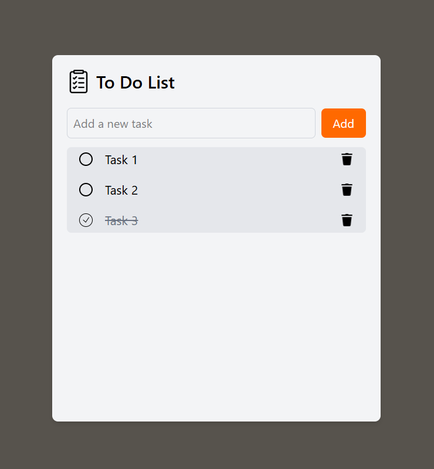

# React To-Do List

A responsive to-do list application built with React and styled with Tailwind CSS. This application provides a clean interface for managing daily tasks.

## Features

- Create new tasks with a simple input field
- Mark tasks as complete or incomplete with a single click
- Delete tasks that are no longer needed
- Visual indicators for completed tasks (strikethrough and grayed-out text)
- Responsive design that works on desktop and mobile devices

## Technologies Used

- React 19
- Tailwind CSS 4

